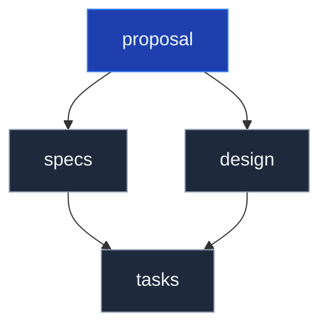

# Phasen & Dokumente

---

# Ablauf

<div class="flex items-center justify-between mt-12 gap-1">
  <div v-click="1" class="flex-1 border border-white/30 rounded-xl p-5 text-center">
    <div class="font-bold text-base mb-2 text-white">explore</div>
    <div class="text-xs text-white/60">Anforderungen zerlegen, Domäne erkunden</div>
  </div>

  <div v-click="2" class="text-white/40 text-2xl flex-shrink-0 px-1">→</div>

  <div v-click="2" class="flex-1 border border-white/30 rounded-xl p-5 text-center">
    <div class="font-bold text-base mb-2 text-white">propose</div>
    <div class="text-xs text-white/60">Change ausformulieren (proposal, spec, design, tasks)</div>
  </div>

  <div v-click="3" class="text-white/40 text-2xl flex-shrink-0 px-1">→</div>

  <div v-click="3" class="flex-1 border border-white/30 rounded-xl p-5 text-center">
    <div class="font-bold text-base mb-2 text-white">apply</div>
    <div class="text-xs text-white/60">implementieren</div>
  </div>

  <div v-click="4" class="text-white/40 text-2xl flex-shrink-0 px-1">→</div>

  <div v-click="4" class="flex-1 border border-white/30 rounded-xl p-5 text-center">
    <div class="font-bold text-base mb-2 text-white">sync</div>
    <div class="text-xs text-white/60">in main-specs synchronisieren</div>
  </div>

  <div v-click="5" class="text-white/40 text-2xl flex-shrink-0 px-1">→</div>

  <div v-click="5" class="flex-1 border border-white/30 rounded-xl p-5 text-center">
    <div class="font-bold text-base mb-2 text-white">archive</div>
    <div class="text-xs text-white/60">archivieren</div>
  </div>
</div>

<!--
Es gibt auch noch das extend profile. nicht näher drauf eingehen, kann nachgelesen werden.
-->

---

# `opsx:explore` – der optionale Vorschritt

`explore` ist kein Pflichtschritt. Es ist ein Denkpartner, bevor Artefakte entstehen.

**Wann lohnt es sich?**

- Anforderung ist vage: _"Irgendwie sollen Nutzer Tiere filtern können"_
- Domäne ist neu: du weißt noch nicht, wie viele Capabilities das betrifft
- Scope ist unklar: Feature oder mehrere Changes?
- Du willst Edge Cases durchdenken, bevor sie in der Spec landen

<v-click>

**Was passiert dabei?**

Ein Gesprächs-Loop mit dem Agenten: Fragen stellen, Annahmen aufdecken, Szenarien durchspielen – aber **noch kein `propose`, noch kein Artefakt**.

```
/opsx:explore   →   Frage-Antwort-Runden   →   "Jetzt sind wir bereit für propose"
```

</v-click>

<v-click>

**Wann überspringen?** Wenn die Anforderung klar ist – einfach direkt mit `/opsx:propose` starten.

</v-click>

---

# `opsx:propose` – alle vier Artefakte in einem Schritt

```sh
/opsx:propose   # interaktiv, oder direkt: /opsx:propose add-filter
```

<div class="flex justify-center">



</div>

Alle vier Artefakte sind Pflicht — tasks ist blockiert, bis specs und design vorliegen

<!--
Die folgenden Slides schauen auf jedes Dokument einzeln.
-->
---

# `proposal.md` – Das WARUM

- Welches Problem wird gelöst – und warum jetzt?
- Vier Abschnitte: Why, What Changes, Capabilities, Impact
- Capabilities: „Vertrag" zur spec.md – pro Capability eine Spec-Datei
- Breaking Changes immer explizit als BREAKING markieren

---

# `spec.md` – Das WAS

- Beschreibt, was das System können soll, nicht wie es implementiert wird
- Struktur: `### Requirement` → `#### Scenario` (WHEN/THEN)
- Szenarien brauchen exakt 4 Hashtags – sonst Silent Failure
- Normative Sprache: SHALL / MUST – kein „should" oder „may"
- Jedes Szenario ist die direkte Vorlage für einen Akzeptanztest

---

# `design.md` – Das WIE

- Architektur und technische Entscheidungen – keine Implementierungsanleitung
- Klare Abgrenzung von Zielen und Nicht-Zielen
- Jede Entscheidung mit Begründung und verworfenen Alternativen – warum X statt Y?
- Risiken im Format `[Risk]` → Mitigation
- „Open Questions" – vor Implementierung klären

---

# `tasks.md` – Die TODO-Liste

- Bricht die Umsetzung in konkrete, verifizierbare Schritte herunter
- Pflichtformat: `- [ ] X.Y Task` – andere Formate werden nicht getrackt
- Tasks mit nummerierten Überschriften gruppieren
- Reihenfolge nach Abhängigkeiten – was muss zuerst passieren?

---

# Delta-Specs: das brownfield-Konzept

Im `changes/`-Ordner steht **nicht die ganze Spec** – nur was sich ändert.

```md
## ADDED Requirements
### Requirement: System SHALL allow deleting an animal
#### Scenario: Tierpfleger löscht ein freies Tier
- **WHEN** ein Tier nicht in einem Gehege ist
- **THEN** lässt sich das Tier löschen

## MODIFIED Requirements
### Requirement: …

## REMOVED Requirements
### Requirement: …
```

- **Drei Sektionen** – ADDED, MODIFIED, REMOVED
- Verhindert Konflikte, wenn mehrere Changes denselben Bereich berühren
- Beim `archive` werden Deltas in die Haupt-Specs unter `openspec/specs/` eingearbeitet
- Davor: `openspec/specs/` = Wahrheit · `openspec/changes/*/specs/` = Vorschläge

---

# Nach propose: apply und archive

Die Artefakte sind fertig. Zwei Phasen schließen den Loop:

**apply** — Agent implementiert Task für Task, gesteuert über `opsx:apply`

**archive** — Change abschließen und Delta-Specs einarbeiten
