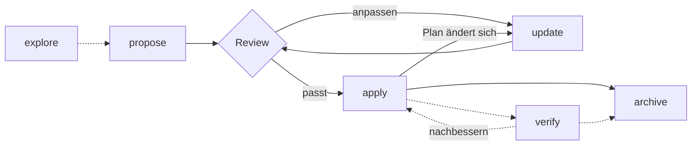
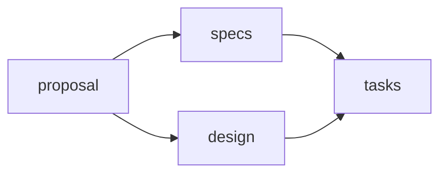

# Phasen & Dokumente

---
layout: default
---

# Was gilt — und was kommt

````md magic-move {lines: true}
```text
openspec/
├── specs/                          ← was gilt
│   ├── animal-create/spec.md
│   ├── …
│   └── animal-profile/spec.md
└── changes/                        ← was vorgeschlagen ist
    └── us-06-dashboard/
        ├── proposal.md
        ├── design.md
        ├── tasks.md
        └── specs/dashboard/spec.md ← Delta-Spec
```

```text
openspec/
├── specs/                          ← was gilt
│   ├── animal-create/spec.md
│   ├── …
│   ├── animal-profile/spec.md
│   └── dashboard/spec.md           ← aus dem Delta
└── changes/
    └── archive/
        └── YYYY-MM-DD-us-06-dashboard/
```
````

<div class="grid mt-3">
<div v-click.hide="1" class="[grid-area:1/1]">

`specs/` beschreibt, wie das System **heute** funktioniert. Jeder Change ist ein eigener Ordner mit allem, was dazugehört.

</div>
<div v-click="1" class="[grid-area:1/1]">

`archive` arbeitet die Deltas in `specs/` ein und legt den Change vollständig ins Archiv. Die Specs beschreiben jetzt den **neuen** Stand.

</div>
</div>

<!--
Das ganze Modell auf einer Folie: zwei Ordner. specs/ ist die Wahrheit,
changes/ sind Vorschläge. Archivieren macht aus einem Vorschlag Wahrheit.

Weil Changes getrennte Ordner sind, können mehrere parallel laufen, ohne sich
zu stören — erst beim Archivieren treffen sie auf specs/.

Genau dieser Change ist Übung 3 am Nachmittag.
-->

---
layout: two-cols-header
class: gepardec-text-sm
---

# Begriffe

::left::

### Die Kernbegriffe

- **Spec** — wie sich ein Teil des Systems verhält
- **Haupt-Specs** — `specs/`, der abgenommene Stand
- **Change** — eine Arbeitseinheit, ein Ordner in `changes/`
- **Artefakt** — ein Dokument im Change
- **Delta-Spec** — nur, was sich an einer Spec ändert
- **Capability** — eine Fähigkeit mit eigener Spec

::right::

### In einer Spec

- **Requirement** — ein Verhalten, das das System haben muss: das *Was*, nicht das *Wie*
- **Scenario** — ein konkretes, prüfbares Beispiel dafür, als WHEN/THEN
- **SHALL / MUST** — verbindlich; SHOULD und MAY schwächen ab (RFC 2119)

<!--
Upstream-Glossar, Abschnitte „The core nouns" und „Inside a spec".

Artefakte im Standard-Schema: proposal, Delta-Specs, design, tasks.

Capability im Zoo-Projekt: animal-list, animal-profile, … — je ein Ordner
unter specs/. Domänen gruppieren Capabilities, wenn ein Projekt wächst:
specs/identity/user-auth/. Das Zoo-Projekt ist flach organisiert.

SHALL/MUST: `openspec validate --strict` verlangt in jedem Requirement ein
englisches SHALL oder MUST. Nur SHOULD — oder ein deutsches SOLL — fällt durch,
ohne --strict gibt es eine Warnung.
-->

---
layout: default
---

# Ablauf

<div class="mt-14 grid grid-cols-5 gap-4 items-start">
  <div v-click>
    <div class="flex items-baseline gap-2">
      <span class="font-mono text-xl text-[var(--gepardec-yellow)]">explore</span>
    </div>
    <div class="mt-3 text-sm opacity-70 leading-snug">Anforderungen zerlegen, Domäne erkunden</div>
  </div>
  <div v-click>
    <div class="flex items-baseline gap-2">
      <span class="text-xl opacity-30">&rarr;</span>
      <span class="font-mono text-xl text-[var(--gepardec-yellow)]">propose</span>
    </div>
    <div class="mt-3 text-sm opacity-70 leading-snug pl-6">Change ausformulieren: proposal, spec, design, tasks</div>
  </div>
  <div v-click>
    <div class="flex items-baseline gap-2">
      <span class="text-xl opacity-30">&rarr;</span>
      <span class="font-mono text-xl text-[var(--gepardec-yellow)]">apply</span>
    </div>
    <div class="mt-3 text-sm opacity-70 leading-snug pl-6">Tasks abarbeiten, implementieren</div>
  </div>
  <div v-click>
    <div class="flex items-baseline gap-2">
      <span class="text-xl opacity-30">&rarr;</span>
      <span class="font-mono text-xl text-[var(--gepardec-yellow)]">sync</span>
    </div>
    <div class="mt-3 text-sm opacity-70 leading-snug pl-6">Deltas in die Haupt-Specs übernehmen</div>
  </div>
  <div v-click>
    <div class="flex items-baseline gap-2">
      <span class="text-xl opacity-30">&rarr;</span>
      <span class="font-mono text-xl text-[var(--gepardec-yellow)]">archive</span>
    </div>
    <div class="mt-3 text-sm opacity-70 leading-snug pl-6">Change abschließen und ablegen</div>
  </div>
</div>

<div v-click class="mt-16">

> Zwischen `propose` und `apply` steht das Review. Nach `archive` beginnt der nächste Change wieder bei `explore`.

</div>

<!--
Es gibt auch noch weitere Workflows, die nur das custom-Profil installiert. Außer verify (kommt nach apply) nicht näher drauf eingehen, kann nachgelesen werden.

sync sieht nach nichts aus, ist aber der Schritt, in dem aus einem Change
dauerhaftes Wissen wird.
-->

---
layout: default
---

# Aktionen, keine Phasen

Jeder Schritt bleibt möglich — die Pfeile zeigen, was als Nächstes sinnvoll ist.

<div class="flex justify-center">


```mermaid {scale: 0.8}
flowchart LR
    E["explore"] -.-> P["propose"]
    P --> R{"Review"}
    R -->|anpassen| U["update"]
    U --> R
    R -->|passt| A["apply"]
    A -->|Plan ändert sich| U
    A -.-> V["verify"]
    V -.->|nachbessern| A
    A --> AR["archive"]
    V -.-> AR
```

</div>

Gestrichelt: optional. Stimmt der Plan nicht, wird er angepasst — nicht umgangen.

<!--
Upstream: „fluid not rigid", „iterative not waterfall". Kein Schritt sperrt
einen anderen; der Preis dafür ist Disziplin — nichts zwingt einen Change,
fokussiert zu bleiben.

verify gibt es nur im custom-Profil, dazu mehr nach apply. sync ist hier
weggelassen: archive bietet es ohnehin an.

Quelle: docs/workflows.md, „Workflow at a Glance".
-->

---
layout: two-cols-header
---

# Szenario: Abrechnungsmonat

Zwei Sichten auf denselben Datensatz.

::left::

### Mitarbeiter

Laufender Monat — sind alle Tasks des Abrechnungsmonats (= Vormonat) bereits erledigt?

::right::

### Projektleiter

Immer Abrechnungsmonat (= Vormonat) — Überblick über den abzuschließenden Monat

::bottom::

Wir begleiten diesen Change von `explore` bis `archive`.

<!--
Das Szenario entstammt einer Anwendung, die ich mit diesem Ansatz modernisiert habe.

"Mitarbeiter" und "Projektleiter" sind hier die Rollennamen des Systems
(employee, project-lead), keine Personenbezeichnungen.
-->

---
layout: two-cols-header
class: gepardec-text-sm
---

# opsx:explore – der Pionier

`explore` ist kein Pflichtschritt. Es ist ein Denkpartner, bevor Artefakte entstehen.

::left::

### Wann lohnt es sich?

- Anforderung ist vage: _"Irgendwie sollen Nutzer Tiere filtern können"_
- Domäne ist neu: du weißt noch nicht, wie viele Capabilities das betrifft
- Du kennst die Codebasis noch nicht gut und möchtest sie erkunden
- Du willst Edge Cases durchdenken, bevor sie in der Spec landen
- Du das Problem kennst, aber keine Lösung beschreiben kannst
- Du verschiedene Lösungsansätze gegenüberstellen möchtest.

::right::

### Was passiert dabei?

Ein Gesprächs-Loop mit dem Agenten: Fragen stellen, Annahmen aufdecken, Szenarien durchspielen – aber **noch kein `propose`, noch kein Artefakt**.

<v-click>

```text
/opsx:explore  →  Frage-Antwort-Runden
               →  "Bereit für propose"
```

</v-click>

::bottom::

**Wann überspringen?** Wenn die Anforderung klar ist – einfach direkt mit `/opsx:propose` starten.

<!--
Faustregel: je ungenauer der Task, umso mehr lohnt es sich
-->

---
layout: conversation
session: "explore · mega-backend"
---

# opsx:explore — Praxisbeispiel

::turns::

<ChatTurn role="user" who="Oliver">

`/opsx:explore` — in the legacy backend there is a `PayrollMonthProvider`: custom logic deciding which payroll month the frontend shows on load. Move this concept into the hexagon. There must be a distinct payrollMonth endpoint for employees and project-leads.

</ChatTurn>

<ChatTurn role="agent" v-click>

Three options: **worktime** owns it, **monthend** owns it, or a new cross-cutting context. The logic depends on monthend task state — but the consumer is the worktime view. What's your intuition?

</ChatTurn>

<ChatTurn role="user" who="Oliver" v-click>

It's just a matter of when which endpoint is called. The first request goes to `monthend/payrollMonth/<role>`, then status-overview and worktime in parallel.

</ChatTurn>

<ChatTurn role="agent" v-click>

That framing makes the answer clear: payrollMonth belongs in **monthend** — no cross-context coupling. The employee rule hinges on one question: when does the previous month count as *completed*? The legacy answers it like this:

```text
completed(prevMonth) := today > 14th
  AND all ControlTimes tasks DONE

completed → current month, else → prev month
```

</ChatTurn>

<ChatTurn role="user" who="Oliver" v-click>

I would actually change this rule a little bit. The month should be considered "completed" when all tasks where the actor is the subject are DONE.

</ChatTurn>

<ChatTurn role="agent" v-click>

`findOpenEmployeeTasks(actorId, prevMonth)` already exists — no new port needed. One thing to settle: the legacy also gated on `today > 14th`. **(A)** keep the gate, **(B)** drop it. What was the intent behind the 14th?

</ChatTurn>

<ChatTurn role="user" who="Oliver" v-click>

I agree, Option B makes more sense indeed. let's drop the "14th gate" :D

</ChatTurn>

<ChatTurn role="agent" v-click>

```text
openTasks(actor, prevMonth).isEmpty()
  → currentMonth    else → prevMonth

project lead → always prevMonth
```

Ready to propose?

</ChatTurn>

<!--
Die echte explore-Session zu genau dem Change, der auf den nächsten Folien
zerlegt wird. Eine Stunde Gespräch, hier auf acht Turns gekürzt.

Zwei Dinge zeigen, mehr nicht:

Erstens fragt der Agent, statt zu bauen. Drei Optionen für den Kontext — und
die Entscheidung fällt nicht aus dem Modell, sondern aus dem Satz, in dem ich
erkläre, wie das Frontend seine Requests tatsächlich absetzt.

Zweitens: die 14.-des-Monats-Regel. Der Agent kennt sie aus dem Altcode, kann
sie aber nicht begründen — also fragt er nach. Genau diese Frage stellt in
einem normalen Sprint niemand, und deshalb steht so eine Regel nach zehn
Jahren immer noch drin.

Export nicht vergessen: --with-clicks.
-->

---
layout: default
---

# opsx:propose

Alle Artefakte entstehen in einem Schritt.

```sh
/opsx:propose   # interaktiv, oder direkt: /opsx:propose add-filter
```

<div class="flex justify-center">


```mermaid
flowchart LR
    proposal --> specs
    proposal --> design
    specs --> tasks
    design --> tasks
```

</div>

Die Pfeile sind Abhängigkeiten, keine Sperren — `design.md` entsteht nur, wenn der Change es braucht.

Kein geändertes Verhalten (Refactoring, Tooling, Doku)? `skip_specs: true` in der `.openspec.yaml` des Change — dann entstehen keine Specs.

<!--
Die folgenden Slides schauen auf jedes Dokument einzeln.

Upstream nennt das „enablers, not gates". Die CLI prüft die Pfeile nicht:
validate, apply und archive laufen auch ohne design.md.

Wann design.md sich lohnt, steht in der design-Instruction von schema.yaml:
Änderung über mehrere Module oder Services, neues Architekturmuster, neue
externe Abhängigkeit oder größere Datenmodell-Änderung, Security, Performance
oder Migration, Unklarheiten, die vor dem Coden entschieden werden sollten.

Im Übungs-Repo schreibt propose trotzdem immer ein design.md: die Skills dort
wurden noch mit OpenSpec 1.3.1 erzeugt.
-->

---
layout: conversation
session: "propose · mega-backend"
---

# opsx:propose — Praxisbeispiel

::turns::

<ChatTurn role="user" who="Oliver">

Yes, write up the proposal `/opsx:propose`

</ChatTurn>

<ChatTurn role="tool" meta="openspec new change" v-click>

```
✔ Created change 'add-payroll-month-endpoints'
  (schema: spec-driven)
```

</ChatTurn>

<ChatTurn role="tool" meta="openspec status --json" v-click>

```json
{ "artifacts": [
  { "id": "proposal", "status": "ready" },
  { "id": "design",   "status": "blocked",
    "missingDeps": ["proposal"] },
```

</ChatTurn>

<ChatTurn role="tool" meta="openspec instructions proposal --json" v-click>

```json
{ "artifactId": "proposal",
  "schemaName": "spec-driven",
  "outputPath": "proposal.md",
  "instruction": "Create the proposal document
     that establishes WHY this change is needed…" }
```

</ChatTurn>

<ChatTurn role="tool" meta="Write — proposal.md" v-click>

```md
## Why

When the frontend loads, it needs to know which
payroll month to display before fetching any data…
```

</ChatTurn>

<ChatTurn role="agent" v-click>

Now I'll create `design.md` and both spec files.

</ChatTurn>

<ChatTurn role="tool" meta="Write × 3" v-click>

```
design.md
specs/payroll-month/spec.md
specs/monthend-rest-api/spec.md
```

</ChatTurn>

<ChatTurn role="tool" meta="Write — tasks.md" v-click>

```md
## 1. OpenAPI Contract

- [ ] 1.1 Add `GET /monthend/payroll-month/employee`
      to openapi/paths/monthend.yaml…
```

</ChatTurn>

<ChatTurn role="tool" meta="openspec status" v-click>

```
Progress: 4/4 artifacts complete
[x] proposal  [x] design  [x] specs  [x] tasks
All artifacts complete!
```

</ChatTurn>

<ChatTurn role="agent" v-click>

`design.md` — 5 decisions, including why the 14th gate is dropped. `specs/` — 3 resolution rules plus 5 REST scenarios. `tasks.md` — 16 tasks. Run `/opsx:apply` when you're ready to implement.

</ChatTurn>

<!--
Der "aha"-Moment: proposal, spec, design und tasks entstehen in einem Rutsch.

Wichtig für Kapitel 5: zwischen jedem Write steht ein openspec-Aufruf. Der
Agent fragt die CLI, was als Nächstes dran ist — er entscheidet es nicht selbst.

Export nicht vergessen: --with-clicks.
-->

---
layout: default
---

# proposal.md – Das WARUM

- Welches Problem wird gelöst – und warum jetzt?
- Vier Abschnitte: Why, What Changes, Capabilities, Impact
- Capabilities: „Vertrag" zur spec.md – pro Capability eine Spec-Datei
- Breaking Changes immer explizit als BREAKING markieren

---
layout: document
source: proposal.md
depth: 2
---

# Proposal — Praxisbeispiel

::doc::

## Why

When the frontend loads, it needs to know which payroll month to display before fetching any data — this month is not always the current calendar month. The legacy backend has a `PayrollMonthProvider` concept for this, but it lives in the REST layer and has never been migrated to the hexagon. Without it, the hexagon's monthend and worktime endpoints cannot be used as the primary data source on initial page load.

## What Changes

- Add `GET /monthend/payroll-month/employee` endpoint — resolves the active payroll month for the authenticated employee based on their open monthend tasks
- Add `GET /monthend/payroll-month/project-lead` endpoint — resolves the active payroll month for the authenticated project lead (always previous month)
- Add `GetEmployeePayrollMonthUseCase` and `GetProjectLeadPayrollMonthUseCase` to the `monthend` application layer
- Add corresponding service implementations in the `monthend` application layer

## Capabilities

### New Capabilities
- `payroll-month`: Rules for resolving the active payroll month per actor role, and the REST endpoints that expose it

### Modified Capabilities
- `monthend-rest-api`: Two new endpoints added to the monthend REST surface

## Impact

- New endpoints in `com.gepardec.mega.hexagon.monthend`
- New use cases and services in `monthend.application` and `monthend.application.port.inbound`
- `MonthEndTaskRepository` (existing outbound port) used as-is — no new ports needed
- No changes to the legacy backend
- Frontend can replace the legacy `GET /worker/payrollMonth` call with `GET /monthend/payroll-month/employee`, and use the new project-lead endpoint as a new capability

---
layout: default
---

# spec.md – Das WAS

- Beschreibt Verhalten, das man von außen prüfen kann — nicht, wie es gebaut ist
- **Faustregel:** Kann sich etwas ändern, ohne dass sich sichtbares Verhalten ändert? Dann gehört es nicht in die Spec.
- Struktur: `### Requirement` → `#### Scenario` (WHEN/THEN) — exakt 4 Hashtags, sonst Silent Failure
- Jedes Requirement braucht ein SHALL/MUST und mindestens ein Scenario
- Jedes Scenario ist die Vorlage für einen Akzeptanztest

<!--
Nicht in die Spec: Klassen- und Funktionsnamen, Library- oder Framework-Wahl,
Implementierungsschritte. Das gehört in design.md oder tasks.md.

Rein in die Spec: beobachtbares Verhalten, Eingaben, Ausgaben, Fehlerfälle,
externe Rahmenbedingungen wie Security oder Kompatibilität.

Quelle: specs-Instruction in schema.yaml, docs/concepts.md.
-->

---
layout: document
source: specs/payroll-month/spec.md
depth: 4
---

# Spec — Neue Capability

::doc::

## ADDED Requirements

### Requirement: Employee payroll month resolves based on open monthend tasks
The system SHALL resolve the active payroll month for an authenticated employee by inspecting their open monthend tasks for the previous calendar month. If no open tasks exist for the previous month (including the case where no tasks have been generated yet), the system SHALL return the current calendar month. Otherwise, the system SHALL return the previous calendar month.

#### Scenario: Employee has open tasks in previous month
- **WHEN** the authenticated employee has one or more open monthend tasks where they are the subject for the previous calendar month
- **THEN** the resolved payroll month is the previous calendar month

#### Scenario: Employee has no open tasks in previous month
- **WHEN** the authenticated employee has no open monthend tasks where they are the subject for the previous calendar month
- **THEN** the resolved payroll month is the current calendar month

#### Scenario: No tasks have been generated yet for previous month
- **WHEN** no monthend tasks exist at all for the previous calendar month for the authenticated employee
- **THEN** the resolved payroll month is the current calendar month

### Requirement: Project-lead payroll month always resolves to previous month
The system SHALL resolve the active payroll month for an authenticated project lead as the previous calendar month, unconditionally. No task state is consulted.

#### Scenario: Project lead requests their payroll month
- **WHEN** an authenticated project lead requests the payroll month
- **THEN** the resolved payroll month is the previous calendar month regardless of any task state

### Requirement: Payroll month resolution does not apply a calendar-day gate
The system SHALL NOT apply any day-of-month threshold when resolving the payroll month. The resolution SHALL depend only on task completion state (for employees) or be unconditional (for project leads).

#### Scenario: Employee completes all tasks before the 14th
- **WHEN** the authenticated employee has no open tasks for the previous month and today is before the 14th of the current month
- **THEN** the resolved payroll month is still the current calendar month

---
layout: document
source: specs/monthend-rest-api/spec.md
depth: 4
---

# Spec — Geänderte Capability

::doc::

## ADDED Requirements

### Requirement: Payroll month is available via role-suffixed endpoints
The system SHALL provide two role-specific payroll month endpoints — one for the employee view and one for the project-lead view — so that actors holding both roles can independently request either resolved month. `GET /monthend/payroll-month/employee` SHALL return the resolved payroll month for the authenticated employee. `GET /monthend/payroll-month/project-lead` SHALL return the resolved payroll month for the authenticated project lead.

#### Scenario: Employee retrieves their payroll month
- **WHEN** an authenticated employee requests `GET /monthend/payroll-month/employee`
- **THEN** the API returns the resolved payroll month as a `YearMonth` string in `yyyy-MM` format
- **THEN** the response reflects the payroll month resolution rule defined in the `payroll-month` capability

#### Scenario: Project lead retrieves their payroll month
- **WHEN** an authenticated project lead requests `GET /monthend/payroll-month/project-lead`
- **THEN** the API returns the resolved payroll month as a `YearMonth` string in `yyyy-MM` format
- **THEN** the resolved month is the previous calendar month

#### Scenario: Project lead retrieves employee payroll month for their own employee view
- **WHEN** an authenticated project lead requests `GET /monthend/payroll-month/employee`
- **THEN** the API applies the employee rule to the authenticated lead as the subject actor
- **THEN** the response may differ from the result of `GET /monthend/payroll-month/project-lead`

#### Scenario: Unauthenticated caller cannot access payroll month endpoints
- **WHEN** an unauthenticated caller requests either payroll month endpoint
- **THEN** the API rejects the request as unauthorized

#### Scenario: Non-project-lead cannot access the project-lead payroll month endpoint
- **WHEN** an authenticated actor without the project-lead role requests `GET /monthend/payroll-month/project-lead`
- **THEN** the API rejects the request as forbidden

---
layout: two-cols-header
---

# Gute Requirements, gute Scenarios

::left::

### Requirement

- Ein Verhalten, ein SHALL — drei „und außerdem“ sind drei Requirements
- Beobachtbar: „zeigt einen Fehler, wenn der Name fehlt“ statt „validiert Eingaben sinnvoll“

::right::

### Scenario

- Prüft sein Requirement, statt es umzuformulieren
- Deckt die Fälle ab, in denen Bugs wohnen: leer, abgelaufen, doppelt
- Der Titel nennt den Fall: „Pflichtfelder fehlen“ statt „Test 2“

::bottom::

**Test:** Könnte jemand, der den Code nie gesehen hat, prüfen, ob es erfüllt ist?

<!--
Im Praxisbeispiel ist „No tasks have been generated yet for previous month"
genau so ein Randfall-Scenario. „Pflichtfelder fehlen" steht wörtlich in der
Zoo-Spec animal-create.

Vor dem Approve fragen: Welchen Fall würde ich am wenigsten kaputt sehen
wollen — und hat er ein Scenario?

Die KI gut anleiten: Absicht UND Grenze nennen („Filter nach Tierart — keine
neue API"), wichtige Fälle beim Namen nennen, dann nachschärfen. Das
Artefakt ist Markdown, es darf auch von Hand geändert werden.

Quelle: docs/writing-specs.md.
-->

---
layout: default
---

# design.md – Das WIE

- Architektur und technische Entscheidungen – keine Implementierungsanleitung
- Klare Abgrenzung von Zielen und Nicht-Zielen
- Jede Entscheidung mit Begründung und verworfenen Alternativen – warum X statt Y?
- Risiken im Format `[Risk]` → Mitigation
- „Open Questions" – vor Implementierung klären

---
layout: document
source: design.md
---

# Design — Praxisbeispiel

::doc::

## Context

The legacy backend resolves the "active payroll month" via a `PayrollMonthProvider` in the REST layer — a CDI-qualified bean injected into resource implementations. Two variants exist: one for employees (stateful check against step entries) and one for management/project-leads (always previous month). Neither has been migrated to the hexagon.

The frontend calls a payroll-month endpoint on initial page load to anchor subsequent data fetches (monthend status overview, worktime). Without this in the hexagon, the frontend must continue to rely on the legacy backend for this bootstrapping step.

## Goals / Non-Goals

**Goals:**
- Add `GET /monthend/payroll-month/employee` and `GET /monthend/payroll-month/project-lead` to the hexagon
- Place all logic in the `monthend` bounded context (application layer)
- Reuse the existing `MonthEndTaskRepository.findOpenEmployeeTasks` port without modification

**Non-Goals:**
- Migrating or touching the legacy `PayrollMonthProvider` — it stays as-is until the legacy is decommissioned
- Adding payroll month resolution to the `worktime` context
- Introducing any new outbound port

## Decisions

### Decision: payroll-month endpoints belong in the `monthend` context

**Rationale**: The employee rule depends directly on monthend task state (`findOpenEmployeeTasks`). Placing it in `monthend` requires no cross-BC dependency. Placing it in `worktime` would require `worktime` to reach into `monthend` state via a new outbound port, violating the BC boundary.

**Alternative considered**: `shared` context — rejected because the concept is not truly cross-cutting; only the frontend treats it as a bootstrapping step, not something multiple BCs need.

### Decision: Two separate use cases — `GetEmployeePayrollMonthUseCase` and `GetProjectLeadPayrollMonthUseCase`

**Rationale**: The rules are different in kind, not just parameterisation. The employee rule queries repository state; the project-lead rule is a pure date computation. Separate use cases keep each testable in isolation and leave a clear seam to evolve the project-lead rule independently in future.

**Alternative considered**: Single use case with a role parameter — rejected because it merges two distinct policies into one place, complicating future changes to either rule.

### Decision: Drop the legacy "14th of month" gate

**Rationale**: The gate was a conservative buffer — "don't advance to the current month until we're halfway through it." The new rule is simpler and more correct: the month advances the moment the actor has no open tasks, regardless of calendar date. There is no business requirement for the gate in the hexagon.

### Decision: Empty task list (no tasks generated yet) resolves to current month

**Rationale**: `findOpenEmployeeTasks` returns an empty list both when all tasks are done and when no tasks exist yet. Treating both as "move forward" is consistent with the rule's intent: nothing is blocking the actor. This edge case only arises in the first month of use.

### Decision: `MonthEndTaskRepository.findOpenEmployeeTasks` is sufficient — no new port

**Rationale**: The existing query returns tasks that are open for a given employee and month. An empty result means all employee-owned tasks for that month are done. No new query or port is needed.

### Decision: Endpoints are added to `MonthEndResource` as two new methods

**Rationale**: Consistent with the existing pattern in `MonthEndResource`, which already hosts both employee and project-lead endpoints with per-method role guards. Dedicated sub-resources would add class overhead for two simple read methods.

### Decision: Response is a plain `YearMonth` string (e.g. `"2026-03"`)

**Rationale**: The only information the frontend needs is the resolved month. A wrapper object adds no value. Consistent with the worktime endpoints that accept `YearMonth` as a string path/query param.

## Risks / Trade-offs

- **Empty-task-list ambiguity** → The "no tasks yet" and "all tasks done" states are indistinguishable at the repository level and both resolve to current month. This is an accepted simplification; it only affects the first calendar month of use and the behaviour is reasonable in both cases.

- **Project-lead rule is static** → Always returning previous month may need revision if business rules change (e.g. a project-lead gets the same smart-check as employees). The separate use case provides the right seam for this without touching the employee path.

- **Legacy and hexagon endpoints coexist** → Both `GET /worker/payrollMonth` (legacy) and `GET /monthend/payroll-month/employee` will exist simultaneously until the legacy is decommissioned. This is intentional and not a risk — the frontend migrates when ready.

---
layout: default
---

# tasks.md – Die TODO-Liste

- Bricht die Umsetzung in konkrete Schritte herunter, jeder klein genug für eine Session
- **Jeder Task nennt, wie er verifiziert wird** — Test, Befehl oder beobachtbares Verhalten
- Pflichtformat: `- [ ] X.Y Task` – andere Formate werden nicht getrackt
- Tasks mit nummerierten Überschriften gruppieren
- Reihenfolge nach Abhängigkeiten – was muss zuerst passieren?

<!--
Die Verifikationsregel steht in der tasks-Instruction von schema.yaml. Das
Praxisbeispiel ist älter: die meisten seiner Tasks nennen noch keine
Verifikation.
-->

---
layout: document
source: tasks.md
---

# Tasks — Praxisbeispiel

::doc::

## 1. OpenAPI Contract

- [ ] 1.1 Add `GET /monthend/payroll-month/employee` path to `src/main/resources/openapi/paths/monthend.yaml` — response is a `string` in `yyyy-MM` format, requires `EMPLOYEE` role
- [ ] 1.2 Add `GET /monthend/payroll-month/project-lead` path to `src/main/resources/openapi/paths/monthend.yaml` — response is a `string` in `yyyy-MM` format, requires `PROJECT_LEAD` role
- [ ] 1.3 Verify generated Java API interface `MonthEndApi` includes the two new methods after build (`mvn generate-sources` or `mvn quarkus:dev`)

## 2. Application Inbound Ports

- [ ] 2.1 Create `GetEmployeePayrollMonthUseCase` interface in `monthend/application/port/inbound/` — method returns `YearMonth`, takes `UserId actorId`
- [ ] 2.2 Create `GetProjectLeadPayrollMonthUseCase` interface in `monthend/application/port/inbound/` — method returns `YearMonth`, no parameters needed

## 3. Application Services

- [ ] 3.1 Create `GetEmployeePayrollMonthService` in `monthend/application/` — if `findOpenEmployeeTasks(actorId, prevMonth)` is empty return current month, else return previous month
- [ ] 3.2 Create `GetProjectLeadPayrollMonthService` in `monthend/application/` — return `YearMonth.now().minusMonths(1)`

## 4. REST Adapter

- [ ] 4.1 Add `GetEmployeePayrollMonthUseCase` and `GetProjectLeadPayrollMonthUseCase` to `MonthEndResource` constructor injection
- [ ] 4.2 Implement the `getEmployeePayrollMonth()` method in `MonthEndResource` — delegate to use case, annotate `@MegaRolesAllowed(Role.EMPLOYEE)`, return the resolved `YearMonth` as a string
- [ ] 4.3 Implement the `getProjectLeadPayrollMonth()` method in `MonthEndResource` — delegate to use case, annotate `@MegaRolesAllowed(Role.PROJECT_LEAD)`, return the resolved `YearMonth` as a string

## 5. Tests

- [ ] 5.1 Unit test `GetEmployeePayrollMonthService`: open tasks in prev month → returns prev month
- [ ] 5.2 Unit test `GetEmployeePayrollMonthService`: no open tasks in prev month → returns current month
- [ ] 5.3 Unit test `GetEmployeePayrollMonthService`: no tasks at all for prev month → returns current month
- [ ] 5.4 Unit test `GetProjectLeadPayrollMonthService`: always returns previous month
- [ ] 5.5 REST integration test: `GET /monthend/payroll-month/employee` — authenticated employee with open tasks returns prev month string
- [ ] 5.6 REST integration test: `GET /monthend/payroll-month/employee` — authenticated employee with no open tasks returns current month string
- [ ] 5.7 REST integration test: `GET /monthend/payroll-month/project-lead` — authenticated project lead returns prev month string
- [ ] 5.8 REST integration test: `GET /monthend/payroll-month/project-lead` — non-project-lead actor receives 403

---
layout: default
class: gepardec-text-sm
---

# Delta-Specs

Im Change steht **nicht die ganze Spec** — nur, was sich ändert.

| Sektion | Wofür | Beim Archivieren |
|---|---|---|
| `ADDED` | neues Verhalten | wird angehängt |
| `MODIFIED` | geändertes Verhalten, als vollständiger Block | ersetzt das Requirement |
| `REMOVED` | wegfallendes Verhalten, mit **Reason** und **Migration** | wird entfernt |
| `RENAMED` | nur ein neuer Name: `FROM:` / `TO:` | wird umbenannt |
| `Purpose` | Zweck einer **neuen** Capability | wird Purpose der Haupt-Spec |

Überschriften: `## ADDED Requirements` … `## RENAMED Requirements`, dazu `## Purpose`.

<!--
Die Delta-Form macht parallele Changes an derselben Capability überhaupt erst
möglich. Wie das im Team aussieht, kommt im Team-Kapitel.

Reihenfolge beim Archivieren: RENAMED, REMOVED, MODIFIED, ADDED. Wird ein
Requirement umbenannt und geändert, verweist MODIFIED auf den neuen Namen.

Purpose: nur für eine neue Capability. Bei einer bestehenden Spec ignoriert
archive ihn — dort ändert man den Purpose direkt in openspec/specs/. Ohne
Purpose schreibt archive einen TBD-Platzhalter, den validate --strict anmahnt.
Die Praxisbeispiel-Spec der neuen Capability ist älter als diese Regel.

Nimmt ein REMOVED das letzte Requirement einer Capability, bricht archive ab —
außer die .openspec.yaml des Change setzt retire_capabilities: true. Dann
löscht archive die Spec-Datei.
-->

---
layout: default
---

# MODIFIED richtig schreiben

Ein MODIFIED-Block ersetzt das Requirement vollständig — was nicht drinsteht, geht beim Archivieren verloren.

1. Requirement in `openspec/specs/<capability>/spec.md` suchen
2. Den **ganzen** Block kopieren: vom `### Requirement:` bis zum letzten Scenario
3. Unter `## MODIFIED Requirements` einfügen und anpassen — Überschrift unverändert

Kommt nur Neues dazu und Bestehendes bleibt gleich: **ADDED**, nicht MODIFIED.

Fehlende Scenarios fangen `validate` und `archive` ab — fehlenden Text nicht.

<!--
Praxisbeispiel: monthend-rest-api ist eine geänderte Capability, bekommt aber
ein ADDED Requirement — es kommt nur ein neues Verhalten dazu.

Der Vier-Schritte-Ablauf steht wörtlich in der specs-Instruction von
schema.yaml („MODIFIED requirements workflow").

Beim Review hilft `openspec show <change> --diff`: zeigt pro MODIFIED-Requirement
nur, was sich tatsächlich ändert.
-->

---
layout: default
---

# Ein Change, eine Absicht

**Faustregel:** Lässt sich der Change in einem Satz beschreiben? Wenn nicht — teilen.

- Der Scope im Proposal liest sich wie eine Liste unabhängiger Features
- Das Review dauert einen Nachmittag — also macht es niemand gründlich
- Zwei Leute könnten nicht daran arbeiten, ohne sich in die Quere zu kommen
- Die Hälfte der Tasks ließe sich für sich allein ausliefern

Umgekehrt braucht ein Tippfehler-Fix keine drei Requirements. Der Aufwand folgt dem Risiko.

<!--
Upstream: der häufigste Fehler beim Schreiben ist kein schlecht formuliertes
Requirement, sondern ein Change, der eigentlich drei sind.

Gute Namen machen openspec list lesbar: add-animal-filter statt feature-1.

Quelle: docs/writing-specs.md „Right-size the change", docs/workflows.md
„Keep Changes Focused".
-->

---
layout: default
---

# Zwei Review-Momente

Das erste Review spart am meisten — und wird am häufigsten ausgelassen.

```text
propose ──► PLAN REVIEWEN ──► apply ──► CODE REVIEWEN ──► archive
            vor jeder Zeile Code        mit /opsx:verify
```

Den Plan lesen, solange er noch aus Worten besteht. Den Code prüfen, bevor er zur Wahrheit wird.

<!--
Ein Irrtum im Proposal kostet einen Absatz. Derselbe Irrtum nach apply kostet
den Code, der darauf gebaut wurde.

Nicht jeder Change braucht den vollen Durchgang: ein Tippfehler-Fix verdient
zwanzig Sekunden, ein Change an Auth, Zahlungen oder Daten, die sich nicht
wiederherstellen lassen, jede Frage auf den nächsten Folien.

Quelle: docs/reviewing-changes.md.
-->

---
layout: two-cols-header
class: gepardec-text-sm
---

# Review-Time

Die Artefakte sind fertig. Nun gilt es, sie gründlich in dieser Reihenfolge zu lesen:

::left::

1. `proposal.md`
2. `spec.md` (1 – n)
3. `design.md`
4. `tasks.md`

::right::

<v-clicks>

Abweichung bemerkt? Mit `/opsx:update` eine neue Runde drehen: „Bei Decision 1 im Design-Artefakt steht X, obwohl Y stehen sollte." Oder die Datei direkt ändern — es ist Markdown.

Dieses Spiel wird so lange gespielt, bis alle Artefakte genau das beschreiben, was die Anforderung ist.

**WICHTIG: Keine Open Questions in der `design.md`!**

</v-clicks>

<!--
Wer früh aufhört, spart Zeit: stimmt das Proposal nicht, erst gar nicht
weiterlesen, sondern das Proposal korrigieren.

Open Questions: das Schema erlaubt nur solche, die weder Specs noch Ansatz
noch Task-Zerlegung ändern würden. Alles andere muss vor tasks geklärt sein —
die tasks-Instruction verlangt, solche Fragen vorher mit dem User zu klären.

Im Übungs-Repo fehlt /opsx:update noch: die Skills dort stammen von
OpenSpec 1.3.1. Direkt editieren funktioniert immer.
-->

---
layout: default
class: gepardec-text-sm
---

# Worauf achte ich beim Review?

| Artefakt | Leitfrage | Warnsignale |
|---|---|---|
| `proposal.md` | Ist das das richtige Problem? | Scope ist gewachsen, löst ein anderes Problem, bleibt vage |
| `spec.md` | Ist „fertig“ richtig definiert? | erfundene Anforderungen, Requirement ohne Scenario, neue Spec statt Delta zu einer bestehenden |
| `design.md` | Trägt der Ansatz? | Open Questions, falsche Entscheidungen, Lösung für ein Problem, das keins ist |
| `tasks.md` | Passt der Plan zu den Specs? | Task ohne Requirement, ein Riesen-Task, Arbeit außerhalb des Scopes |

Quer über alles: Gibt es Widersprüche zwischen Artefakten — und **was fehlt?**

<!--
„Was fehlt?" ist der wertvollste Fund: die KI schreibt treu auf, was man
gesagt hat. Was man vergessen hat zu sagen, steht nirgends. Welcher Fall wäre
am schlimmsten, wenn er kaputt ginge — und hat er ein Scenario?

Beispiel für eine Lösung ohne Problem: ein Migrationsplan für ein Feature,
das noch gar nicht ausgeliefert ist.

Quelle: docs/reviewing-changes.md, ergänzt um eigene Erfahrung.
-->

---
layout: default
---

# opsx:apply — Praxisbeispiel


---
layout: two-cols-header
class: gepardec-text-sm
---

# opsx:verify – der Abgleich

Nach `apply`, vor `archive`: Hat der Agent gebaut, was vereinbart war?

::left::

### Was es prüft

- **Completeness** — Tasks erledigt, Requirements umgesetzt
- **Correctness** — Umsetzung trifft Spec und Randfälle
- **Coherence** — Design-Entscheidungen im Code

::right::

### Womit

```text
openspec status --change <name> --json
openspec instructions apply --change <name> --json
  → Artefakte lesen, Belege im Code suchen
```

Meldet **CRITICAL** · **WARNING** · **SUGGESTION** — blockiert aber nichts.

::bottom::

Ein Urteil des Modells, kein Testlauf: verify sucht Tests, führt sie aber nicht aus.

<!--
Auch sinnvoll, nachdem jemand Code von Hand geändert hat: verify zeigt, wo
Code und Artefakte auseinanderlaufen — vor dem Archivieren abgleichen.

verify gibt es nur im custom-Profil:
  openspec config profile   (verify auswählen)
  openspec update           (Skills und Commands neu schreiben)

Die Skill-Anleitung verlangt Stichwortsuche und „reasonable inference", keine
Gewissheit — im Zweifel lieber SUGGESTION als WARNING. Deshalb bleiben Tests
und Linter das eigentliche Netz.

CRITICAL: offene Tasks, nicht gefundene Requirements. WARNING: Abweichung von
Spec oder Design, Scenario ohne Test. SUGGESTION: Muster-Abweichungen.

Fehlt design.md, überspringt verify den Abgleich mit dem Design und sagt das.

Quelle: skills/openspec-verify-change/SKILL.md, docs/workflows.md „Verify".
-->

---
layout: default
class: gepardec-text-sm
---

# Der Plan lebt

Jedes Artefakt ist Markdown und jederzeit änderbar — es gibt keine gesperrte Planungsphase.

| Situation | Was tun |
|---|---|
| Der Plan passt nicht, `apply` läuft noch nicht | `/opsx:update` — oder die Datei direkt ändern |
| Während `apply` zeigt sich: der Ansatz trägt nicht | Artefakt ändern, weiter mit `/opsx:apply` — es liest den aktuellen Stand |
| Jemand hat Code von Hand geändert | Vor `archive` abgleichen: stimmt der Code, die Delta-Spec nachziehen — stimmt die Spec, den Code |

`tasks.md` darf sich ändern — `apply` macht beim ersten offenen Task weiter.

<!--
Warum vor archive abgleichen: beim Archivieren wird die Spec zur Wahrheit.
Sie soll dann beschreiben, was der Code wirklich tut. /opsx:verify zeigt, wo
beides auseinanderläuft.

tasks.md ist eine lebende Checkliste: Tasks dürfen dazukommen, wegfallen oder
umsortiert werden.

Artefakte sind der lebende Plan, kein unterschriebener Vertrag. Der Agent
arbeitet immer mit dem aktuellen Inhalt der Dateien.

Quelle: docs/editing-changes.md.
-->

---
layout: two-cols-header
---

# Update oder neuer Change?

::left::

### Update, wenn …

- dieselbe Absicht besser umgesetzt wird
- der Scope schrumpft — MVP zuerst
- die Codebasis anders ist als gedacht

::right::

### Neuer Change, wenn …

- sich die Absicht grundlegend ändert
- der Scope zu anderer Arbeit wächst
- der ursprüngliche Change für sich fertig werden kann

::bottom::

Abrechnungsmonat: die 14.-Regel doch behalten → **Update**. Projektleiter bekommen denselben Check wie Mitarbeiter → **neuer Change**.

<!--
Das zweite Beispiel steht schon im Design des Praxisbeispiels: unter Risks
heißt es, die Projektleiter-Regel müsse vielleicht einmal denselben
„smart-check" bekommen. Der Change ist ohne das fertig — also ein eigener.

Scope schrumpft: Update, archivieren, und der Rest wird ein neuer Change.

Quelle: docs/workflows.md „When to Update vs Start Fresh", docs/editing-changes.md.
-->

---
layout: conversation
session: "archive · mega-backend"
---

# opsx:archive — Praxisbeispiel

::turns::

<ChatTurn role="user" who="Oliver">

`/opsx:archive add-payroll-month-endpoints`

</ChatTurn>

<ChatTurn role="tool" meta="grep — tasks.md" v-click>

```
open tasks:       0
completed tasks:  18
```

</ChatTurn>

<ChatTurn role="agent" v-click>

All 18 tasks are complete, all artifacts are done. Two delta specs need assessment.

```
payroll-month      no main spec → new file
monthend-rest-api  exists       → +1 requirement
```

</ChatTurn>

<ChatTurn role="tool" meta="AskUserQuestion" v-click>

```
Delta specs exist for this change.
How would you like to proceed?
→ Sync now
```

</ChatTurn>

<ChatTurn role="agent" v-click>

Syncing delta specs via subagent…

</ChatTurn>

<ChatTurn role="agent" v-click>

Sync complete. Now performing the archive.

</ChatTurn>

<ChatTurn role="tool" meta="mv" v-click>

```
changes/add-payroll-month-endpoints
  → changes/archive/
    2026-04-22-add-payroll-month-endpoints
```

</ChatTurn>

<ChatTurn role="agent" v-click>

**Archive Complete** — specs synced to main specs. All artifacts complete. All tasks complete.

</ChatTurn>

<!--
Der wichtige Turn ist der vierte: bevor irgendetwas in specs/ wandert, fragt
das Werkzeug nach. sync ist nicht automatisch, weil das Zusammenführen der
Deltas die Stelle ist, an der die dauerhafte Spezifikation verändert wird.

Kontrast zu Kapitel 3 aufmachen: derselbe Ablauf ginge auch deterministisch
mit `openspec archive` — hier macht ihn ein Agent Schritt für Schritt nach.

Export nicht vergessen: --with-clicks.
-->

---
layout: default
---

# Best practices

- Nach jeder Phase (außer Explore) neue Session starten - sauberes Kontext-Fenster!
- Unklarheiten nach propose klären, bevor apply beginnt
- Implementierungsfehler in derselben Session korrigieren - Spec anpassen, falls das Verhalten davon abweicht
- Umfangreiche Aufgaben: Implementierung von einem anderen Agenten reviewen lassen (neue Session!), z. B. mit `/opsx:verify`
