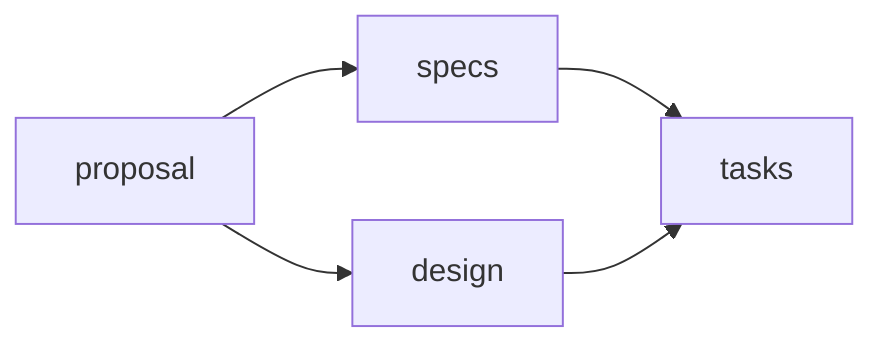

# Phasen & Dokumente

---
layout: default
---

# Ablauf

<div class="mt-14 grid grid-cols-5 gap-4 items-start">
  <div v-click>
    <div class="flex items-baseline gap-2">
      <span class="font-mono text-xl text-[var(--gepardec-yellow)]">explore</span>
    </div>
    <div class="mt-3 text-sm opacity-70 leading-snug">Anforderungen zerlegen, Domäne erkunden</div>
  </div>
  <div v-click>
    <div class="flex items-baseline gap-2">
      <span class="text-xl opacity-30">&rarr;</span>
      <span class="font-mono text-xl text-[var(--gepardec-yellow)]">propose</span>
    </div>
    <div class="mt-3 text-sm opacity-70 leading-snug pl-6">Change ausformulieren: proposal, spec, design, tasks</div>
  </div>
  <div v-click>
    <div class="flex items-baseline gap-2">
      <span class="text-xl opacity-30">&rarr;</span>
      <span class="font-mono text-xl text-[var(--gepardec-yellow)]">apply</span>
    </div>
    <div class="mt-3 text-sm opacity-70 leading-snug pl-6">Tasks abarbeiten, implementieren</div>
  </div>
  <div v-click>
    <div class="flex items-baseline gap-2">
      <span class="text-xl opacity-30">&rarr;</span>
      <span class="font-mono text-xl text-[var(--gepardec-yellow)]">sync</span>
    </div>
    <div class="mt-3 text-sm opacity-70 leading-snug pl-6">Deltas in die Haupt-Specs übernehmen</div>
  </div>
  <div v-click>
    <div class="flex items-baseline gap-2">
      <span class="text-xl opacity-30">&rarr;</span>
      <span class="font-mono text-xl text-[var(--gepardec-yellow)]">archive</span>
    </div>
    <div class="mt-3 text-sm opacity-70 leading-snug pl-6">Change abschließen und ablegen</div>
  </div>
</div>

<div v-click class="mt-16">

> Zwischen `propose` und `apply` steht das Review. Nach `archive` beginnt der nächste Change wieder bei `explore`.

</div>

<!--
Es gibt auch noch das extended profile. Nicht näher drauf eingehen, kann nachgelesen werden.

sync sieht nach nichts aus, ist aber der Schritt, in dem aus einem Change
dauerhaftes Wissen wird.
-->

---
layout: two-cols-header
---

# Szenario: Abrechnungsmonat

Zwei Sichten auf denselben Datensatz.

::left::

### Mitarbeiter

Laufender Monat — sind alle Tasks des Abrechnungsmonats (= Vormonat) bereits erledigt?

::right::

### Projektleiter

Immer Abrechnungsmonat (= Vormonat) — Überblick über den abzuschließenden Monat

::bottom::

Wir begleiten diesen Change von `explore` bis `archive`.

<!--
Das Szenario entstammt einer Anwendung, die ich mit diesem Ansatz modernisiert habe.

"Mitarbeiter" und "Projektleiter" sind hier die Rollennamen des Systems
(employee, project-lead), keine Personenbezeichnungen.
-->

---
layout: two-cols-header
class: gepardec-text-sm
---

# opsx:explore – der Pionier

`explore` ist kein Pflichtschritt. Es ist ein Denkpartner, bevor Artefakte entstehen.

::left::

### Wann lohnt es sich?

- Anforderung ist vage: _"Irgendwie sollen Nutzer Tiere filtern können"_
- Domäne ist neu: du weißt noch nicht, wie viele Capabilities das betrifft
- Scope ist unklar: Feature oder mehrere Changes?
- Du willst Edge Cases durchdenken, bevor sie in der Spec landen

::right::

### Was passiert dabei?

Ein Gesprächs-Loop mit dem Agenten: Fragen stellen, Annahmen aufdecken, Szenarien durchspielen – aber **noch kein `propose`, noch kein Artefakt**.

<v-click>

```text
/opsx:explore  →  Frage-Antwort-Runden
               →  "Bereit für propose"
```

</v-click>

::bottom::

**Wann überspringen?** Wenn die Anforderung klar ist – einfach direkt mit `/opsx:propose` starten.

---
layout: conversation
session: "explore · mega-backend"
---

# opsx:explore — Praxisbeispiel

::turns::

<ChatTurn role="user" who="Oliver">

`/opsx:explore` — in the legacy backend there is a `PayrollMonthProvider`: custom logic deciding which payroll month the frontend shows on load. Move this concept into the hexagon. There must be a distinct payrollMonth endpoint for employees and project-leads.

</ChatTurn>

<ChatTurn role="agent" v-click>

Three options: **worktime** owns it, **monthend** owns it, or a new cross-cutting context. The logic depends on monthend task state — but the consumer is the worktime view. What's your intuition?

</ChatTurn>

<ChatTurn role="user" who="Oliver" v-click>

It's just a matter of when which endpoint is called. The first request goes to `monthend/payrollMonth/<role>`, then status-overview and worktime in parallel.

</ChatTurn>

<ChatTurn role="agent" v-click>

That framing makes the answer clear: payrollMonth belongs in **monthend** — no cross-context coupling. The employee rule hinges on one question: when does the previous month count as *completed*? The legacy answers it like this:

```text
completed(prevMonth) := today > 14th
  AND all ControlTimes tasks DONE

completed → current month, else → prev month
```

</ChatTurn>

<ChatTurn role="user" who="Oliver" v-click>

I would actually change this rule a little bit. The month should be considered "completed" when all tasks where the actor is the subject are DONE.

</ChatTurn>

<ChatTurn role="agent" v-click>

`findOpenEmployeeTasks(actorId, prevMonth)` already exists — no new port needed. One thing to settle: the legacy also gated on `today > 14th`. **(A)** keep the gate, **(B)** drop it. What was the intent behind the 14th?

</ChatTurn>

<ChatTurn role="user" who="Oliver" v-click>

I agree, Option B makes more sense indeed. let's drop the "14th gate" :D

</ChatTurn>

<ChatTurn role="agent" v-click>

```text
openTasks(actor, prevMonth).isEmpty()
  → currentMonth    else → prevMonth

project lead → always prevMonth
```

Ready to propose?

</ChatTurn>

<!--
Die echte explore-Session zu genau dem Change, der auf den nächsten Folien
zerlegt wird. Eine Stunde Gespräch, hier auf acht Turns gekürzt.

Zwei Dinge zeigen, mehr nicht:

Erstens fragt der Agent, statt zu bauen. Drei Optionen für den Kontext — und
die Entscheidung fällt nicht aus dem Modell, sondern aus dem Satz, in dem ich
erkläre, wie das Frontend seine Requests tatsächlich absetzt.

Zweitens: die 14.-des-Monats-Regel. Der Agent kennt sie aus dem Altcode, kann
sie aber nicht begründen — also fragt er nach. Genau diese Frage stellt in
einem normalen Sprint niemand, und deshalb steht so eine Regel nach zehn
Jahren immer noch drin.

Export nicht vergessen: --with-clicks.
-->

---
layout: default
---

# opsx:propose

Alle vier Artefakte entstehen in einem Schritt.

```sh
/opsx:propose   # interaktiv, oder direkt: /opsx:propose add-filter
```

<div class="flex justify-center">


```mermaid
flowchart LR
    proposal --> specs
    proposal --> design
    specs --> tasks
    design --> tasks
```

</div>

Alle vier Artefakte sind Pflicht — tasks ist blockiert, bis specs und design vorliegen.

<!--
Die folgenden Slides schauen auf jedes Dokument einzeln.
-->

---
layout: conversation
session: "propose · mega-backend"
---

# opsx:propose — Praxisbeispiel

::turns::

<ChatTurn role="user" who="Oliver">

Yes, write up the proposal `/opsx:propose`

</ChatTurn>

<ChatTurn role="tool" meta="openspec new change" v-click>

```
✔ Created change 'add-payroll-month-endpoints'
  (schema: spec-driven)
```

</ChatTurn>

<ChatTurn role="tool" meta="openspec status --json" v-click>

```json
{ "artifacts": [
  { "id": "proposal", "status": "ready" },
  { "id": "design",   "status": "blocked",
    "missingDeps": ["proposal"] },
```

</ChatTurn>

<ChatTurn role="tool" meta="openspec instructions proposal --json" v-click>

```json
{ "artifactId": "proposal",
  "schemaName": "spec-driven",
  "outputPath": "proposal.md",
  "instruction": "Create the proposal document
     that establishes WHY this change is needed…" }
```

</ChatTurn>

<ChatTurn role="tool" meta="Write — proposal.md" v-click>

```md
## Why

When the frontend loads, it needs to know which
payroll month to display before fetching any data…
```

</ChatTurn>

<ChatTurn role="agent" v-click>

Now I'll create `design.md` and both spec files.

</ChatTurn>

<ChatTurn role="tool" meta="Write × 3" v-click>

```
design.md
specs/payroll-month/spec.md
specs/monthend-rest-api/spec.md
```

</ChatTurn>

<ChatTurn role="tool" meta="Write — tasks.md" v-click>

```md
## 1. OpenAPI Contract

- [ ] 1.1 Add `GET /monthend/payroll-month/employee`
      to openapi/paths/monthend.yaml…
```

</ChatTurn>

<ChatTurn role="tool" meta="openspec status" v-click>

```
Progress: 4/4 artifacts complete
[x] proposal  [x] design  [x] specs  [x] tasks
All artifacts complete!
```

</ChatTurn>

<ChatTurn role="agent" v-click>

`design.md` — 5 decisions, including why the 14th gate is dropped. `specs/` — 3 resolution rules plus 5 REST scenarios. `tasks.md` — 16 tasks. Run `/opsx:apply` when you're ready to implement.

</ChatTurn>

<!--
Der "aha"-Moment: proposal, spec, design und tasks entstehen in einem Rutsch.

Wichtig für Kapitel 5: zwischen jedem Write steht ein openspec-Aufruf. Der
Agent fragt die CLI, was als Nächstes dran ist — er entscheidet es nicht selbst.

Export nicht vergessen: --with-clicks.
-->

---
layout: default
---

# proposal.md – Das WARUM

- Welches Problem wird gelöst – und warum jetzt?
- Vier Abschnitte: Why, What Changes, Capabilities, Impact
- Capabilities: „Vertrag" zur spec.md – pro Capability eine Spec-Datei
- Breaking Changes immer explizit als BREAKING markieren

---
layout: default
class: wrap-code
---

# proposal.md — Praxisbeispiel

<<< @/public/artifacts/add-payroll-month-endpoints/proposal.md md {maxHeight:'330px'}

---
layout: default
---

# spec.md – Das WAS

- Beschreibt, was das System können soll, nicht wie es implementiert wird
- Struktur: `### Requirement` → `#### Scenario` (WHEN/THEN)
- Szenarien brauchen exakt 4 Hashtags – sonst Silent Failure
- Normative Sprache: SHALL / MUST – kein „should" oder „may"
- Jedes Szenario ist die direkte Vorlage für einen Akzeptanztest

---
layout: two-cols-header
class: wrap-code gepardec-text-sm
---

# spec.md — Praxisbeispiel

::left::

#### specs/payroll-month/spec.md

<<< @/public/artifacts/add-payroll-month-endpoints/specs/payroll-month/spec.md md {maxHeight:'300px'}

::right::

#### specs/monthend-rest-api/spec.md

<<< @/public/artifacts/add-payroll-month-endpoints/specs/monthend-rest-api/spec.md md {maxHeight:'300px'}

---
layout: default
---

# design.md – Das WIE

- Architektur und technische Entscheidungen – keine Implementierungsanleitung
- Klare Abgrenzung von Zielen und Nicht-Zielen
- Jede Entscheidung mit Begründung und verworfenen Alternativen – warum X statt Y?
- Risiken im Format `[Risk]` → Mitigation
- „Open Questions" – vor Implementierung klären

---
layout: default
class: wrap-code
---

# design.md — Praxisbeispiel

<<< @/public/artifacts/add-payroll-month-endpoints/design.md md {maxHeight:'330px'}

---
layout: default
---

# tasks.md – Die TODO-Liste

- Bricht die Umsetzung in konkrete, verifizierbare Schritte herunter
- Pflichtformat: `- [ ] X.Y Task` – andere Formate werden nicht getrackt
- Tasks mit nummerierten Überschriften gruppieren
- Reihenfolge nach Abhängigkeiten – was muss zuerst passieren?

---
layout: default
class: wrap-code
---

# tasks.md — Praxisbeispiel

<<< @/public/artifacts/add-payroll-month-endpoints/tasks.md md {maxHeight:'330px'}

---
layout: two-cols-header
class: gepardec-text-sm
---

# Delta-Specs

Im `changes/`-Ordner steht **nicht die ganze Spec** – nur was sich ändert.

::left::

```md
## ADDED Requirements
### Requirement: System SHALL allow deleting an animal
#### Scenario: Tierpfleger löscht ein freies Tier
- **WHEN** ein Tier nicht in einem Gehege ist
- **THEN** lässt sich das Tier löschen

## MODIFIED Requirements
### Requirement: …

## REMOVED Requirements
### Requirement: …
```

::right::

- **Drei Sektionen** – ADDED, MODIFIED, REMOVED
- Verhindert Konflikte, wenn mehrere Changes denselben Bereich berühren
- Beim `archive` werden Deltas in die Haupt-Specs unter `openspec/specs/` eingearbeitet
- `openspec/specs/` ist der abgenommene Stand, `openspec/changes/*/specs/` sind offene Vorschläge

---
layout: two-cols-header
class: gepardec-text-sm
---

# Review-Time

Die Artefakte sind fertig. Nun gilt es, sie gründlich in dieser Reihenfolge zu lesen:

::left::

1. `proposal.md`
2. `spec.md` (1 – n)
3. `design.md`
4. `tasks.md`

::right::

<v-clicks>

Abweichung bemerkt? Neue Runde drehen: „Bei Decision 1 im Design-Artefakt steht X, obwohl Y stehen sollte."

Dieses Spiel wird so lange gespielt, bis alle Artefakte genau das beschreiben, was die Anforderung ist.

**WICHTIG: Keine Open Questions in der `design.md`!**

</v-clicks>

---
layout: default
---

# Worauf achte ich beim Review?

- Gibt es Open Questions?
- Gibt es Widersprüche zwischen Artefakten?
- Wurden Anforderungen erfunden bzw. falsche Entscheidungen getroffen?
- Ist die formulierte Spec ein Delta zu einer bestehenden Spec oder eine neue?
- Wird eine Lösung für ein Problem beschrieben, das eigentlich kein Problem ist? (z.B. Migration-Plan für ein Feature noch in Entwicklung)

---
layout: default
class: gepardec-text-lg
---

# Nach propose: apply und archive

Die Artefakte sind fertig. Zwei Phasen schließen den Loop:

**apply** — Agent implementiert Task für Task, gesteuert über `opsx:apply`

**archive** — Change abschließen und Delta-Specs einarbeiten

---
layout: default
---

# opsx:apply — Praxisbeispiel


---
layout: conversation
session: "archive · mega-backend"
---

# opsx:archive — Praxisbeispiel

::turns::

<ChatTurn role="user" who="Oliver">

`/opsx:archive add-payroll-month-endpoints`

</ChatTurn>

<ChatTurn role="tool" meta="grep — tasks.md" v-click>

```
open tasks:       0
completed tasks:  18
```

</ChatTurn>

<ChatTurn role="agent" v-click>

All 18 tasks are complete, all artifacts are done. Two delta specs need assessment.

```
payroll-month      no main spec → new file
monthend-rest-api  exists       → +1 requirement
```

</ChatTurn>

<ChatTurn role="tool" meta="AskUserQuestion" v-click>

```
Delta specs exist for this change.
How would you like to proceed?
→ Sync now
```

</ChatTurn>

<ChatTurn role="agent" v-click>

Syncing delta specs via subagent…

</ChatTurn>

<ChatTurn role="agent" v-click>

Sync complete. Now performing the archive.

</ChatTurn>

<ChatTurn role="tool" meta="mv" v-click>

```
changes/add-payroll-month-endpoints
  → changes/archive/
    2026-04-22-add-payroll-month-endpoints
```

</ChatTurn>

<ChatTurn role="agent" v-click>

**Archive Complete** — specs synced to main specs. All artifacts complete. All tasks complete.

</ChatTurn>

<!--
Der wichtige Turn ist der vierte: bevor irgendetwas in specs/ wandert, fragt
das Werkzeug nach. sync ist nicht automatisch, weil das Zusammenführen der
Deltas die Stelle ist, an der die dauerhafte Spezifikation verändert wird.

Kontrast zu Kapitel 3 aufmachen: derselbe Ablauf ginge auch deterministisch
mit `openspec archive` — hier macht ihn ein Agent Schritt für Schritt nach.

Export nicht vergessen: --with-clicks.
-->

---
layout: default
---

# Best practices

- Nach jeder Phase (außer Explore) neue Session starten - sauberes Kontext-Fenster!
- Unklarheiten nach propose klären, bevor apply beginnt
- Implementierungsfehler in derselben Session korrigieren - Spec anpassen, falls das Verhalten davon abweicht
- Umfangreiche Aufgaben: Implementierung von einem anderen Agenten reviewen lassen (neue Session!)
