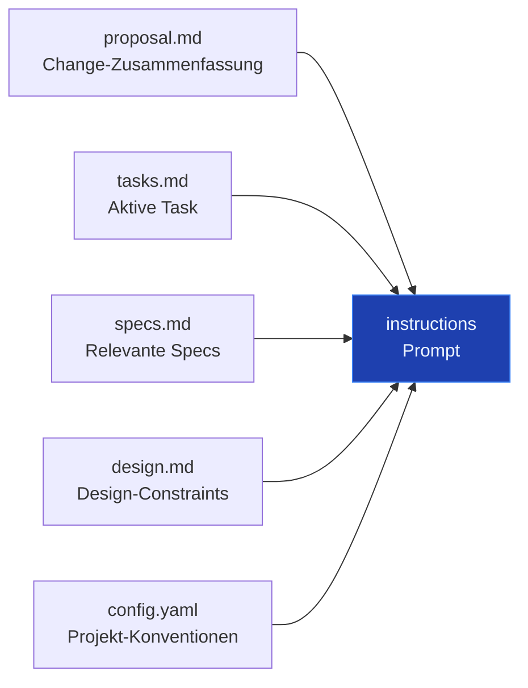
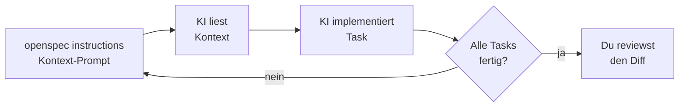

# Die CLI als Agent-Bridge

Die apply-Phase — `opsx:apply` und `openspec instructions` — 15 min

---

# Die Lücke

Erinnert ihr euch: der Agent ist standardmäßig kontextblind.

Er weiß nicht, was entschieden wurde, was nicht verhandelbar ist, was als nächstes zu tun ist.

`openspec instructions` ist das Werkzeug dagegen.

---

# `openspec instructions`

Generiert einen fokussierten Prompt, mit dem der Agent mit der Arbeit beginnt.

```sh
$ openspec instructions us-03-add-animal
```

Der Output ist ein strukturierter Prompt, der dem Agenten sagt:
- Welchen Change er implementieren soll
- Welche Task als nächstes dran ist
- Welche Specs und Design-Entscheidungen relevant sind

---

# Was steckt in den Instructions?



Der Agent bekommt genau das, was er braucht – nicht mehr, nicht weniger.

---

# Der Agent-Loop (`opsx:apply`)



`opsx:apply` ist der Skill, der diesen Loop ausführt — Task für Task, bis alle `[x]` sind.

Die CLI steuert den Loop. Der Agent erledigt die Arbeit. Du reviewst den Diff.

---

# Live-Demo

Ein Change von `openspec list` bis zur Implementierung.

```sh
openspec list
openspec show us-03-add-animal
openspec status --change us-03-add-animal
openspec instructions us-03-add-animal
```

Dann: Output an einen KI-Agenten übergeben und zusehen.
