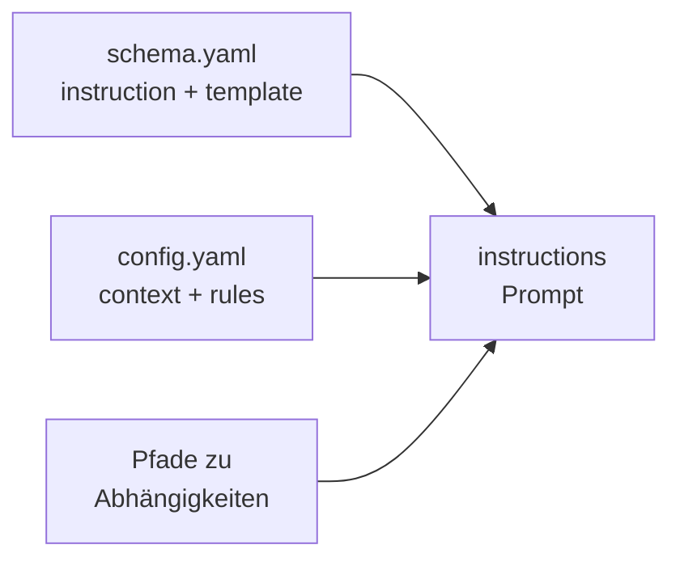
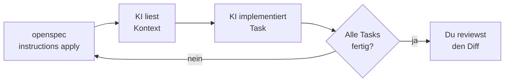

# Die CLI als Agent-Bridge

---
layout: default
class: gepardec-text-lg
---

# Die Lücke

Erinnert ihr euch: der Agent ist standardmäßig kontextblind.

Er weiß nicht, was entschieden wurde, was nicht verhandelbar ist, was als nächstes zu tun ist.

`openspec instructions` ist das Werkzeug dagegen.

---
layout: default
---

# openspec instructions

Liefert dem Agenten Anweisungen für das Erstellen eines Artefakts — Template, Projekt-Kontext, Inhalte der Abhängigkeiten.

```sh
$ openspec instructions <artifact> --change us-06-dashboard
```

Gültige Argumente: `proposal` · `specs` · `design` · `tasks` — dazu `apply` und `archive`

`/opsx:propose` ruft diesen Befehl für jedes Artefakt auf. `apply` liefert Implementierungsanweisungen für den aktiven Task, `archive` die Eingaben für den Abschluss — rein lesend, es wird nichts archiviert.

---
layout: default
---

# Was steckt in den Instructions?


```mermaid {scale: 0.75}
flowchart LR
    S["schema.yaml\ninstruction + template"] --> IP
    C["config.yaml\ncontext + rules"] --> IP
    A["Pfade zu\nAbhängigkeiten"] --> IP["instructions\nPrompt"]
```

Der Agent liest die referenzierten Dateien selbst — `instructions` zeigt ihm nur, wo er schauen soll.

<!--
Die Felder heißen im JSON genau so: instruction, template, context, rules,
dependencies. rules erscheinen nur für das Artefakt, für das sie in
config.yaml stehen; context erscheint bei jedem.
-->

---
layout: default
class: gepardec-text-sm
---

# Wer bestimmt was?

Vier Schichten, jede mit genau einer Aufgabe.

| Schicht | Wo | Bestimmt |
|---|---|---|
| Lenkrad | Skill / Slash-Command | Vorgehen und Guardrails: welcher Befehl wann, wann nachfragen |
| Motor | `openspec` CLI | Zustand, Abhängigkeiten aus dem Schema, deterministischer Merge bei `openspec archive` |
| Schema | `schema.yaml` + Templates | Form und Schreibregeln jedes Artefakts |
| Projekt | `openspec/config.yaml` | Kontext und Regeln eures Teams |

Eigene Regeln gehören in `config.yaml`. Eine eigene Artefakt-Form braucht ein eigenes Schema.

<!--
Mit /opsx:archive und /opsx:sync führt der Agent den Merge selbst durch — die
CLI merged deterministisch nur bei openspec archive (siehe Kapitel 3).

Die Regeln aus Kapitel 2 — Delta-Operationen, MODIFIED-Workflow, Verifikation
pro Task, wann design.md sich lohnt — stammen nicht aus dem Skill, sondern aus
der instruction des Schemas. Der Skill sagt nur, wann welches Artefakt dran ist.

Ein eigenes Schema: openspec schema fork, siehe FAQ.
-->

---
layout: default
---

# schema.yaml – der Styleguide

Hier stehen die Schreibregeln aus Kapitel 2.

```yaml {5-8|9-11}
- id: tasks
  template: tasks.md
  instruction: |
    …
    - Each task MUST be a checkbox: `- [ ] X.Y Task description`
    - Tasks should be small enough to complete in one session
    - Each task MUST state how to verify completion (a test, command,
      observable behavior, or delivered artifact). …
  requires:
    - specs
    - design
```

`instruction`: wie der Agent schreibt · `template`: die Form · `requires`: die Reihenfolge

<!--
Auszug aus dem Standard-Schema spec-driven (schemas/spec-driven/schema.yaml).

Zuerst markiert: die Schreibregeln, die auf der tasks.md-Folie standen.
Nach dem Klick: die Abhängigkeit aus dem propose-Diagramm.

Genauso steht in der specs-Instruction der MODIFIED-Workflow samt „Common
pitfall", und in der design-Instruction, wann design.md sich lohnt und welche
Open Questions erlaubt sind.

Selbst nachlesen: openspec instructions tasks --change <change> --json, Feld
instruction.
-->

---
layout: default
---

# Der Agent-Loop


```mermaid
flowchart LR
    INS["openspec\ninstructions apply"] --> READ["KI liest\nKontext"]
    READ --> IMPL["KI implementiert\nTask"]
    IMPL --> CHECK{"Alle Tasks\nfertig?"}
    CHECK -->|nein| INS
    CHECK -->|ja| DONE["Du reviewst\nden Diff"]
```

`opsx:apply` ist der Skill, der diesen Loop ausführt — Task für Task, bis alle `[x]` sind.

Die CLI steuert den Loop. Der Agent erledigt die Arbeit. Du reviewst den Diff.

---
layout: default
---

# Live-Demo

Was der Agent als Input bekommt — einmal pro Artefakt, einmal für die Implementierung.

```sh
# Während propose: Anweisungen zum Schreiben eines Artefakts
openspec instructions proposal --change us-06-dashboard
openspec instructions specs --change us-06-dashboard
openspec instructions design --change us-06-dashboard
openspec instructions tasks --change us-06-dashboard

# Während apply: Anweisungen zur Implementierung des nächsten Tasks
openspec instructions apply --change us-06-dashboard
```

<!--
Vergleich: Alle Tasks erledigt vs. alle Tasks offen

Validate: wann wird eine violation geworfen??
-->
