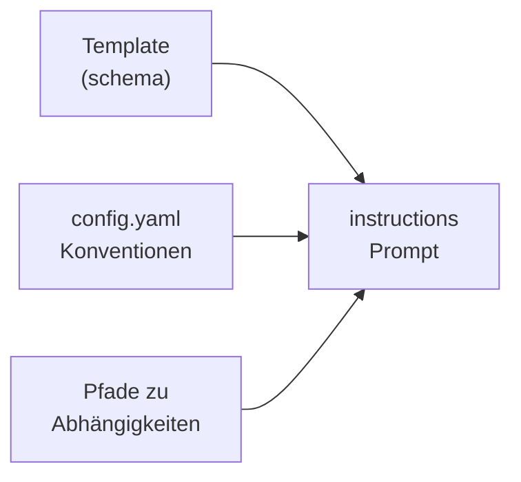
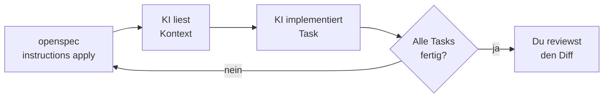

# Die CLI als Agent-Bridge

---
layout: default
class: gepardec-text-lg
---

# Die Lücke

Erinnert ihr euch: der Agent ist standardmäßig kontextblind.

Er weiß nicht, was entschieden wurde, was nicht verhandelbar ist, was als nächstes zu tun ist.

`openspec instructions` ist das Werkzeug dagegen.

---
layout: default
---

# openspec instructions

Liefert dem Agenten Anweisungen für das Erstellen eines Artefakts — Template, Projekt-Kontext, Inhalte der Abhängigkeiten.

```sh
$ openspec instructions <artifact> --change us-06-dashboard
```

Gültige Argumente: `proposal` · `specs` · `design` · `tasks` · `apply`

`/opsx:propose` ruft diesen Befehl für jedes Artefakt auf. Sonderfall `apply`: liefert Implementierungsanweisungen für den aktiven Task.

---
layout: default
---

# Was steckt in den Instructions?


```mermaid {scale: 0.75}
flowchart LR
    T["Template\n(schema)"] --> IP
    C["config.yaml\nKonventionen"] --> IP
    A["Pfade zu\nAbhängigkeiten"] --> IP["instructions\nPrompt"]
```

Der Agent liest die referenzierten Dateien selbst — `instructions` zeigt ihm nur, wo er schauen soll.

---
layout: default
---

# Der Agent-Loop


```mermaid
flowchart LR
    INS["openspec\ninstructions apply"] --> READ["KI liest\nKontext"]
    READ --> IMPL["KI implementiert\nTask"]
    IMPL --> CHECK{"Alle Tasks\nfertig?"}
    CHECK -->|nein| INS
    CHECK -->|ja| DONE["Du reviewst\nden Diff"]
```

`opsx:apply` ist der Skill, der diesen Loop ausführt — Task für Task, bis alle `[x]` sind.

Die CLI steuert den Loop. Der Agent erledigt die Arbeit. Du reviewst den Diff.

---
layout: default
---

# Live-Demo

Was der Agent als Input bekommt — einmal pro Artefakt, einmal für die Implementierung.

```sh
# Während propose: Anweisungen zum Schreiben eines Artefakts
openspec instructions proposal --change us-06-dashboard
openspec instructions specs --change us-06-dashboard
openspec instructions design --change us-06-dashboard
openspec instructions tasks --change us-06-dashboard

# Während apply: Anweisungen zur Implementierung des nächsten Tasks
openspec instructions apply --change us-06-dashboard
```

<!--
Vergleich: Alle Tasks erledigt vs. alle Tasks offen

Validate: wann wird eine violation geworfen??
-->
