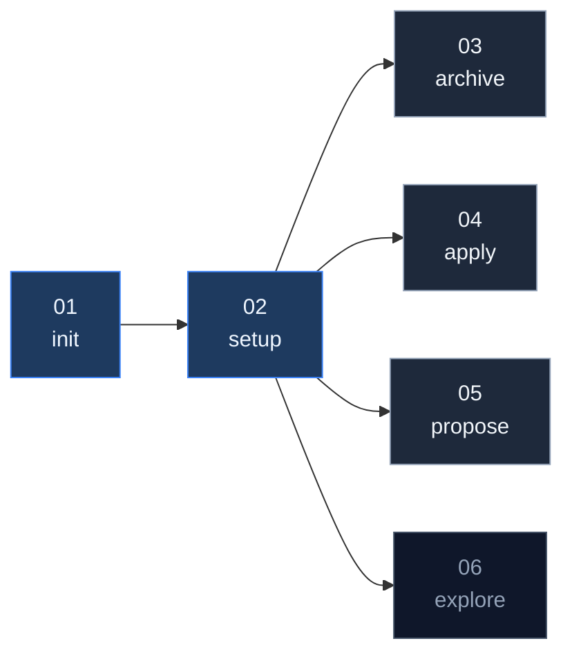

# Hands-on Übungen

---

# Übersicht & Abhängigkeiten

01 und 02 sind Pflicht. 03–05 können parallel bearbeitet werden. 06 ist Bonus.

---

# Übung 1 – OpenSpec selbst aufsetzen

`exercises/01_init_openspec/README.md`

Setup, CLI-Installation und `openspec init` — ihr seht, was OpenSpec aus einem leeren Repo macht.

---

# Übung 2 – Workshop-Setup übernehmen

`exercises/02_setup_openspec/README.md`

Ihr kopiert das vorkonfigurierte `openspec/`-Verzeichnis in euer Repo-Root. Ab jetzt arbeitet ihr mit dem vollständigen Workshop-Stand — inkl. aller Changes und Specs.

---

# Übung 3 – Einen aktiven Change archivieren

`exercises/03_archive_change/README.md`

Der Change `us-06-dashboard` ist fertig implementiert. Archiviert ihn mit OpenSpec — und schaut euch an, was danach in `openspec/` anders ist.

---

# Übung 4 – Einen vorbereiteten Change anwenden

`exercises/04_apply_change/README.md`

Ein fertig ausformulierter Change liegt bereit. Ihr kopiert ihn ins `openspec/changes/`-Verzeichnis, wendet ihn an und archiviert ihn anschließend.

---

# Übung 5 – Change-Proposal aus einer User Story

`exercises/05_propose_change/README.md`

Eine User Story liegt bereit. Erstellt daraus ein vollständiges Change-Proposal mit `openspec propose`.

Wer noch Token übrig hat: wendet den Change auch gleich an und archiviert ihn.

---

# Übung 6 – Exploration einer unklaren Anforderung

`exercises/06_explore_requirements/README.md`

Eine vage Anforderung liegt bereit. Startet eine Exploration, um die Anforderung zu schärfen — und erstellt am Ende ein Proposal.

Wer noch Token übrig hat: wendet den Change auch gleich an und archiviert ihn.
