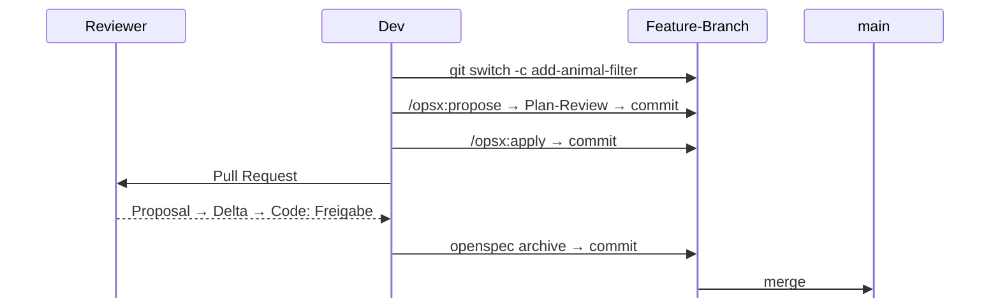

# OpenSpec im Team

---
layout: default
---

# Ein Change, ein Branch, ein PR

Plan und Code im selben Branch, gemeinsam reviewt — OpenSpec fasst git nicht an.

<!--
Ein Change passt in den Ablauf, den ihr schon habt.

OpenSpec liest und schreibt nur Markdown unter openspec/. Im Projekt-Repo
committet, branched, pusht und merged es nie. Alles hier ist Konvention, kein
Zwang.

openspec/ wird committet wie Quellcode: Haupt-Specs, aktive Changes, Archiv.

Die Commits entsprechen der Konvention aus den Übungen; vor dem Merge darf
alles zu einem Commit gesquasht werden.

Archiviert wird mit openspec archive, nicht mit /opsx:archive — warum, steht
in Kapitel 3.

Quelle: docs/team-workflow.md.
-->

---
layout: default
---

# Review im Pull Request

Die Delta-Spec sagt dem Reviewer in Klartext, was der Change tun soll — bevor er eine Zeile Code liest.

1. `proposal.md` — richtiges Problem, richtiger Scope?
2. Delta unter `specs/` — ist „fertig“ richtig definiert?
3. Code-Diff — liefert er genau diese Requirements?

Wer den Ansatz anzweifelt, kommentiert das Proposal — nicht 300 Zeilen Code.

<!--
Den Link zur Delta-Spec oben in die PR-Beschreibung stellen, damit Reviewer
dort anfangen.

Für geänderte Requirements hilft openspec show <change> --diff: pro
MODIFIED-Requirement nur, was sich tatsächlich ändert.

Das ist dieselbe Reihenfolge wie beim Review nach propose — jetzt im PR und
mit Code dahinter.
-->

---
layout: default
---

# Archivieren vor dem Merge

Nach dem Code-Review archiviert, wer den PR gebaut hat — erst dann wird gemergt.

- Auf `main` gibt es nie Code ohne passende Specs
- Der PR zeigt den Diff an `openspec/specs/` mit
- Ändern zwei Changes dieselben Zeilen einer Spec, meldet git den Konflikt beim Merge

Wird erst nach dem Merge archiviert, kann der zweite Change den ersten **still überschreiben**.

<!--
Durchgespielt mit OpenSpec 1.13.0: zwei Branches ändern per MODIFIED dasselbe
Requirement.
- Archiv im PR, dieselben Zeilen geändert: git meldet beim zweiten Merge einen
  Konflikt in openspec/specs/animal-list/spec.md.
- Archiv nach dem Merge: validate und archive laufen durch, die zweite Fassung
  ersetzt die erste vollständig — ohne Warnung.

Ganz dicht ist auch das Archiv im PR nicht: ändert der eine Change die
SHALL-Zeile und der andere eine THEN-Zeile desselben Requirements, mergt git
ohne Konflikt — und die Spec kann sich danach widersprechen. Verloren geht
dabei nichts, aber nach dem Merge lohnt ein Blick auf den Diff in
openspec/specs/.

Upstream nennt beide Konventionen und empfiehlt „nach dem Merge", weil der PR
dann ruhiger bleibt. Wir empfehlen bewusst das Gegenteil.

Wichtig ist nur: im Team eine Konvention wählen und dabei bleiben.
-->

---
layout: default
---

# Parallel arbeiten

- **Verschiedene Changes, verschiedene Leute** — getrennte Ordner, getrennte Branches, kein Problem
- **Ein Change, ein Owner** — zwei Leute im selben Change-Ordner kollidieren wie in jeder anderen Datei
- **Konflikte entstehen in `openspec/specs/`** — wenn zwei Changes dieselben Zeilen einer Spec ändern oder an dieselbe Spec anhängen

Ein Konflikt dort ist ein Feature: zwei Changes sind sich uneinig, wie sich das System verhalten soll.

<!--
Durchgespielt mit OpenSpec 1.13.0, Archiv jeweils im PR:
- ADDED + ADDED an derselben Spec: Konflikt (beide hängen ans Ende an)
- MODIFIED + MODIFIED an denselben Zeilen: Konflikt
- MODIFIED + MODIFIED an verschiedenen Zeilen desselben Requirements: sauberer
  Merge — die Spec kann sich danach widersprechen
- MODIFIED + ADDED: sauberer Merge, außer das geänderte Requirement steht am
  Ende der Spec
- MODIFIED an verschiedenen Requirements: sauberer Merge

git vergleicht Zeilen, nicht Requirements.

Wie man so einen Konflikt auflöst, steht im FAQ.

Wird ein Change zu groß für einen Owner, ist das meist ein Zeichen, dass er
geteilt werden sollte — siehe „Ein Change, eine Absicht".
-->
